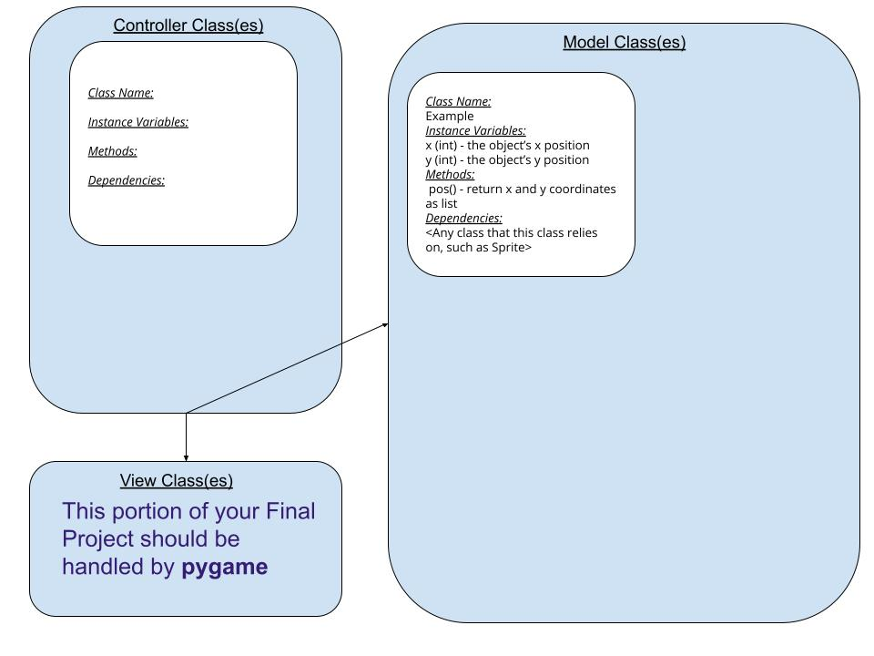

:warning: Everything between << >> needs to be replaced (remove << >> after replacing)
# CS110 Project Proposal
# Rock Wwall
## CS 110 Final Project
### Spring 2022
Sofia Fasullo: Back End Specialist,  
Isabel Tozer: Software Lead , 
Angela Chen: Front End Specialist, 
### Here we have a climber climbing a rock wall.  The user can click on any holds to move the climber. We originally thought we could use physics and have the climber swing and move according to the laws of physics but that proved to be too high level for us. With what we have submitted now we only have the climber moving through holds and getting tired if the user hits the space bar. In the future we would have wanted to get our timer to work so the climber would be tired over time and fall, and we wanted to get a distance measure to work so the climber couldn't grab holds that were too far. Lastly, we would have wanted to get our screen to show that the user won when the climber reached the top.(https://docs.google.com/document/d/1H4R6yLL7som1lglyXWZ04RvTp_RvRFCCBn6sqv-82ps/edit#)

### Team: Tozer, Fasillo, Chen
#### Sofia Fasillo, Angela Chen, Isabel Tozer

***

## Project Description *(Software Lead)*

Our final project is an interactive game where the player picks an avatar to be a climber and a level and ascends a rock climbing slope. The player will click on the holds associated with their level (color coded and varying distances depending on level). There is a that restarts after timer after each new hold the climber moves to. If the player waits too long the climber will get too tired and fall off. If the player chooses a hold too far away they will fall off. The player wins by reaching the top!

***    

## User Interface Design *(Front End Specialist)*

* Background of rock wall is the only screen in our program.  The background will have holds randomly scattered on it. We initially wanted a "try again!" text when the hold was too far for the climber to reach, but could not figure that out.

***        

## Program Design *(Backend Specialist)*

* Non-Standard libraries
    * pymunk is a non-standard library we are using for physics with the falling climber motion, we did not end up implementing this however
    * For each additional module you should include
        * url for the module documentation
        * a short description of the module
* Class Interface Design
    * see drawing in assets folder
        * 
    * This does not need to be overly detailed, but should show how your code fits into the Model/View/Controller paradigm.
* Classes
class Button
Each hold, when you click on the button, the climber moves to the hold
  Instance variable: button, image, and location.  It’s location is random
Class climber
  Main character, moves to where buttons are, if they’re tired, they shake
  Instance variable: climber, name “Angela,” position, and then image
Class Rock wall 
  This class only has one image, it is pretty simple.  It is an image of a rockwall.
  Instance variable: image and the position (0,0)

## Project Structure *(Software Lead)*

The Project is broken down into the following file structure:

* main.py
* src
    * Contains all python videos
* assets
    * Media images
* etc
    * We do not have a demo video, so we will describe what we wanted to happen here.  We wanted the climber to start at the bottom and have colorful holds appear on the rock wall.  We wanted to climber to fall according to gravity but we did not advance the code enough in time to add the physics package. We wanted the climber also to win when they reached the top, not be able to grab holds when they were too far away, and shake/fall after some time.

***

## Tasks and Responsibilities *(Software Lead)*

   * Angela Chen got the images from online and uploaded them Sofia wrote the controller.py and the climber.py. She was main lead and delegated tasks
Isabel worked on the rockwall.py
Angela worked on the button.py
Sofia looked at the code and profreaded it, as she had the most knowledge of code.  She wrote the controller.py.

### Software Lead - Isabel Tozer

Software lead wrote ATP, designed the testing strategy.

### Front End Specialist - Angela Chen

Front-end lead conducted significant research on how we wanted the game to look.  She uploaded all of the images of the climber, the holds, and the rock wall. If we were more advanced, she would upload multiple sprite images of the climber so we could animate them.

### Back End Specialist - Sofia Fasullo

The back-end specialist profreaded the rockwall.py, button.py, and the climber.py

## Testing *(Software Lead)*

We run the code and click on various holds to see if the climber goes to that hold. It was supposed to be the distance between the holds, and if it was too far, then the climber couldn’t reach it, but we were unable to figure it out.

## ATP

| Step   | Procedure     | Expected Results  | Actual Results |
| ----------------------|:-------------:| -----------------:| -------------- |
|  1  | Click "Start" Button  | GUI window appears which screen with 4 climber options w/photos   | Happened as expected.  |
|  2  | Pick a displayed Climber Avatar  | One of the climbers is selected and will be highlighted, screen changes to show rock wall with holds and climber at bottom . Climber starts at the bottom and can now start Climbing| All of this happened!|
|  3  | Click on one climber body part (right arm, left arm, right leg or left leg) and drag to a hold button  | Climber moves body part to hold (unless the hold is too far away!), timer starts for 5s countdown), Climber needs to pick a new hold, Climber starts shaking if she doesn't pick a hold fast enough, rock wall scrolls down as climber moves up, this step keeps repeating until reach top or fall | We didn't have time to advance to a multi-part climber, so we kept the climber as one simple image and one rectangle without moving limbs. Climber only shakes if user presses the spacebar
|  4  | Click on hold that's too far or click on hold too late  | Climber falls to pad on ground, Screen flashes text "Try again!" Climber respawns at the bottom. Fall count at top right corner goes up by one count.| did not happen, did not input distance between holds
|  5  | Click on top hold  | Climber moves to top of rock wall, Screen flashes text "You did it!", screen turns to black and "Start" button appears, back to start of game (or if we get sophisticated could go to higher level) |Did not happen, since holds appear randomly could not designate top hold, in the future would pre-code x-y coordinates for all the holds and designate the top hold as the "winner"            
|  6  | wait to long OR click on hold too far away | Screen flashes text "you fell", Climber falls, game exits, "retry" button appears, back to start | could not implement timer, this did not happen
etc...
