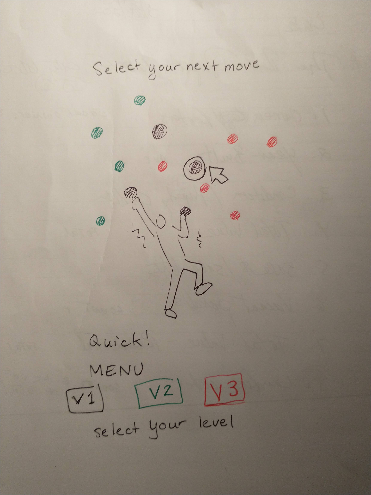
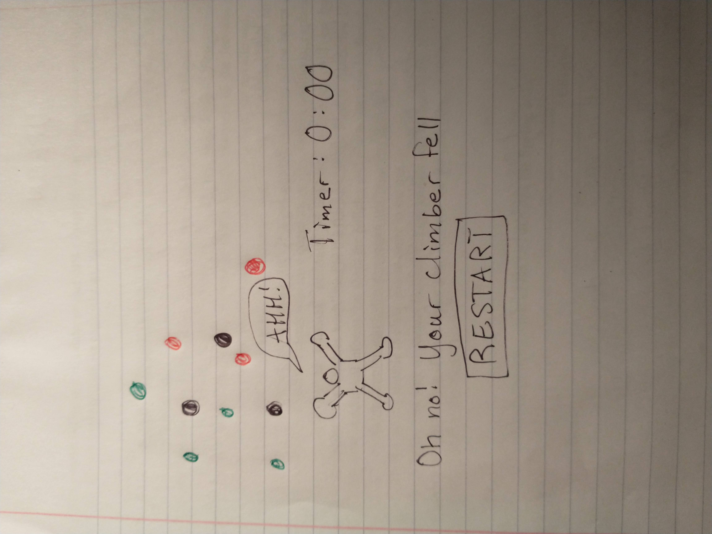

:warning: Everything between << >> needs to be replaced (remove << >> after replacing)
# CS110 Project Proposal
# Rock Wwall
## CS 110 Final Project
### Spring 2022
### Here we have a climber climbing a rock wall.  The user can click on any holds to move the climber. We originally thought we could use physics and have the climber swing and move according to the laws of physics but that proved to be too high level for us.(https://docs.google.com/document/d/1H4R6yLL7som1lglyXWZ04RvTp_RvRFCCBn6sqv-82ps/edit#)

<< [repl](#) >>

<< [link to demo presentation slides](#) >>

### Team: Tozer, Fasillo, Chen
#### Sofia Fasillo, Angela Chen, Isabel Tozer

***

## Project Description *(Software Lead)*

<< Our final project is an interactive game where the player picks an avatar to be a climber and a level and ascends a rock climbing slope. The player will click on the holds associated with their level (color coded and varying distances depending on level). There is a that restarts after timer after each new hold the climber moves to. If the player waits too long the climber will get too tired and fall off. If the player chooses a hold too far away they will fall off. The player wins by reaching the top! >>

***    

## User Interface Design *(Front End Specialist)*

* << A wireframe or drawing of the user interface concept along with a short description of the interface. You should have one for each screen in your program. >>
    * For example, if your program has a start screen, game screen, and game over screen, you should include a wireframe / screenshot / drawing of each one and a short description of the components
* << You should also have a screenshot of each screen for your final GUI >>
* 
* 

***        

## Program Design *(Backend Specialist)*

* Non-Standard libraries
    * pymunk is a non-standard library we are using for physics with the falling climber motion
    * For each additional module you should include
        * url for the module documentation
        * a short description of the module
* Class Interface Design
    * << A simple drawing that shows the class relationships in your code (see below for an example). >>
        * 
    * This does not need to be overly detailed, but should show how your code fits into the Model/View/Controller paradigm.
* Classes
    * << You should have a list of each of your classes with a description. >>

## Project Structure *(Software Lead)*

The Project is broken down into the following file structure:

* main.py
* src
    * Contains all python videos
* assets
    * Media images
* etc
    * We do not have a demo video, so we will describe what we wanted to happen here.  We wanted the climber to spawn at the bottom and have coloroful holds appear on the rock wall.  We wanted to climber to move up according to gravity, but we didn't know how to code that so now we have a climber going wherever the user clicks regardless of physics.

***

## Tasks and Responsibilities *(Software Lead)*

   * Angela Chen got the images from online and uploaded them Sofia wrote the controller.py and the climber.py. She was main lead and delegated tasks
Isabel wrote the rockwall.py
Angela wrote the button.py

### Software Lead - Isabel Tozer

Software lead wrote ATP, designed the testing strategy.

### Front End Specialist - Angela Chen

Front-end lead conducted significant research on how we wanted the game to look.  She uploaded all of the images of the climber, the holds, and the rock wall. If we were more advanced, she would upload multiple sprite images of the climber so we could animate them.

### Back End Specialist - Sofia Fasullo

The back-end specialist 

## Testing *(Software Lead)*

* << Describe your testing strategy for your project. >>
    * << Example >>

## ATP

| Step   | Procedure     | Expected Results  | Actual Results |
| ----------------------|:-------------:| -----------------:| -------------- |
|  1  | Click "Start" Button  | GUI window appears which screen with 4 climber options w/photos   | Happened as expected.  |
|  2  | Pick a displayed Climber Avatar  | One of the climbers is selected and will be highlighted, screen changes to show rock wall with holds and climber at bottom . Climber starts at the bottom and can now start Climbing| All of this happened!|
|  3  | Click on one climber body part (right arm, left arm, right leg or left leg) and drag to a hold button  | Climber moves body part to hold (unless the hold is too far away!), timer starts for 5s countdown), Climber needs to pick a new hold, Climber starts shaking if she doesn't pick a hold fast enough, rock wall scrolls down as climber moves up, this step keeps repeating until reach top or fall | All of this did work, but the climber did not shake
|  4  | Click on hold that's too far or click on hold too late  | Climber falls to pad on ground, Screen flashes text "Try again!" Climber respawns at the bottom. Fall count at top right corner goes up by one count.| did not happen
|  5  | Click on top hold  | Climber moves to top of rock wall, Screen flashes text "You did it!", screen turns to black and "Start" button appears, back to start of game (or if we get sophisticated could go to higher level) |Did not actually happen              
|  6  | wait to long OR click on hold too far away | Screen flashes text "you fell", Climber falls, game exits, "retry" button appears, back to start | Did not actually happen
etc...

Start climbing
Screen moves up
Pick handholds for climber to grab onto

